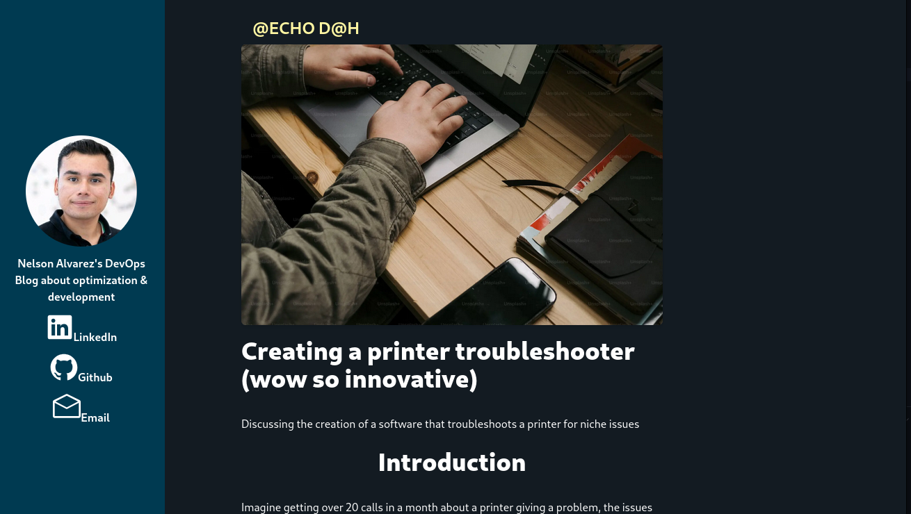

# What is LakeByte

LakeByte is my personal Resume Blog site which hosts blogs I create based on my epxerience in the field. 

## Current progress

This was a project that was initially started in october however resumed progress during late December as the project had a more concise direction.

Currently the website has had a bit work completed to have it look like the following:

The ideal plan is to refine the articles generated by markdown files, and implement pagination

# Current Release

- Has the base layout and capability to have the markdown files as articles for the website.