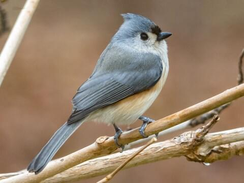

# Developer Journal

I wanted to revisit the site with an actual purpose as the last time it was worked on there was no objective. This time it will be be properly built with an actual article and appealing color scheme fitting my design.

## Bugs

### SideBar and site color
Well one of the annoying parts was about the sidebar and backjground color not populating fully, I found out it was because of [this](https://stackoverflow.com/questions/66025707/how-do-you-set-a-full-page-background-color-in-tailwind-css)

### Markdwon Color

Because when i first made this I didn't know what I was working with, it didn't dawn on me to utilize [prose](https://github.com/tailwindlabs/tailwindcss-typography), and understanding how it works. I was so stumped why I couldn't change the default color but then it dawned on me when I read this [post](https://tjaddison.com/blog/2020/08/updating-to-tailwind-typography-to-style-markdown-posts/)

## Color Scheme

So Something I struglled originally was the color scheme for the website, I came to the conclusion to utilize the Tufted titnouse as displayed below as my reference:

This led me to utilize the following [pallette](https://coolors.co/palette/314d59-f0eadc-bbb9ad-60797d-585858) as my reference for the page

Hpowever after tetsing the color scheme, and helwp with the lil 8 year old we determined it was better to go for a darker scheme, which led to this [color scheme](https://www.color-hex.com/color-palette/21810) based on the Boat Tailed **Grackle**

So

